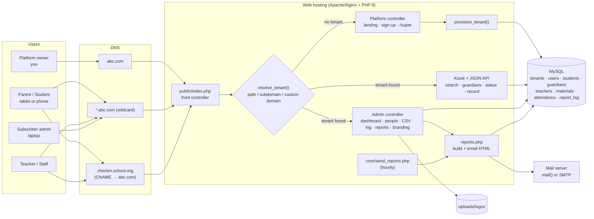
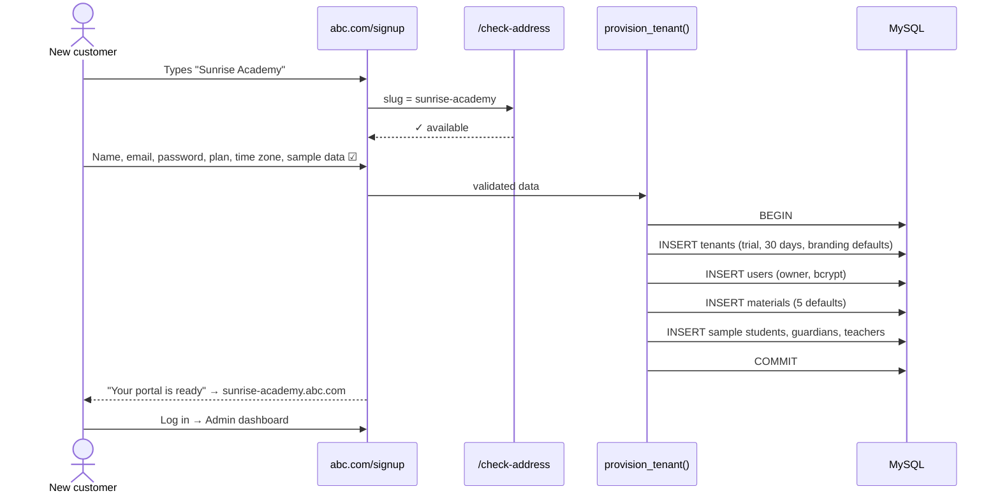
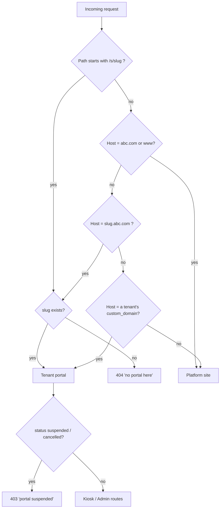
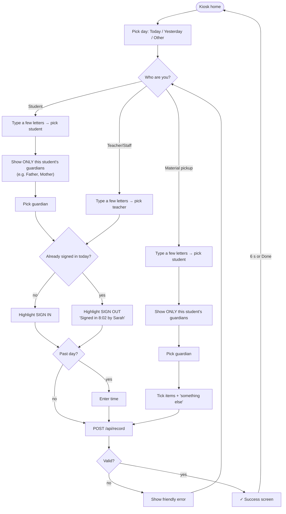
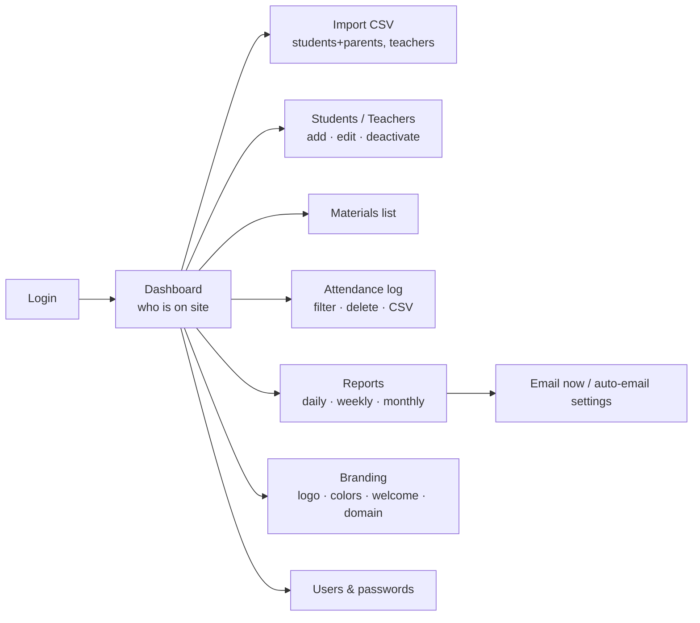
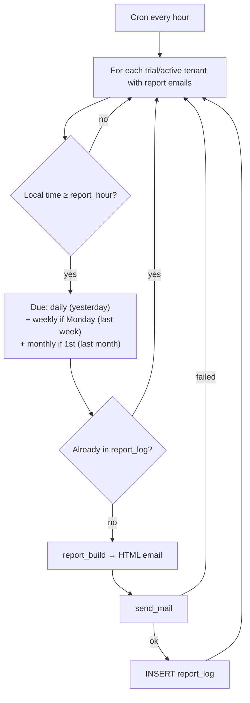
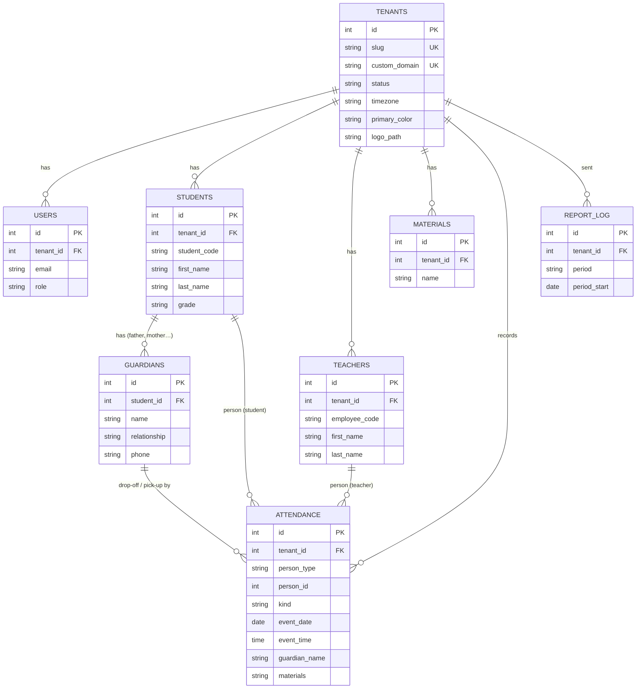

# TimeInOut — Architecture & Flow Diagrams

Diagrams are written in Mermaid, which GitHub renders automatically. A visual version with screenshots is in [`docs/mockup/index.html`](mockup/index.html).

## 1. System architecture

## 2. Sign-up & automatic provisioning

## 3. Request → tenant resolution

## 4. Kiosk flow (student, teacher, material pickup)

## 5. Admin workflow

## 6. Scheduled reports

## 7. Data model (ER)

